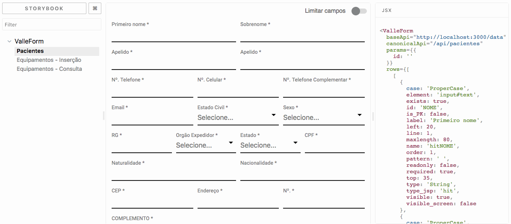
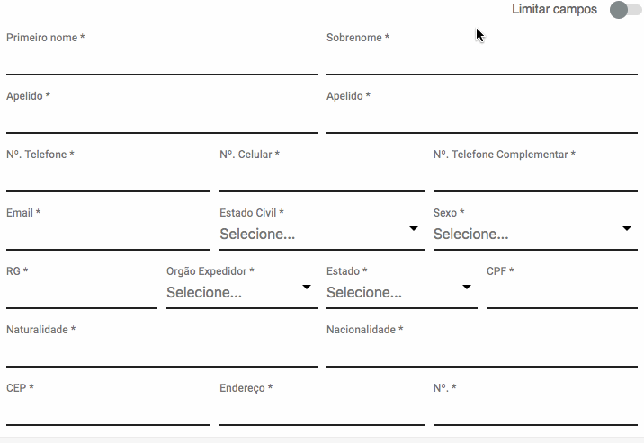
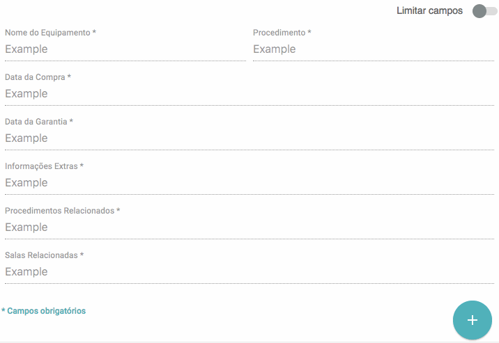

# valleForm

*[React](https://reactjs.org/) component for convert the valle [screens-api data structure](https://github.com/valleweb/valle-screen-data-structure) to web component based forms.*

[](https://www.npmjs.com/package/valleform)
[](https://david-dm.org/valleweb/valleform)

***Write***

```jsx
<valleForm
    rows = { [...] }
    baseApi = ''
    canonicalApi = ''
    params = { {...} }
/>
```

***... and build:***



## Table of contents

- [Features](#features)
- [Environment dependencies](#environment-dependencies)
- [Installation](#installation)
- [Usage](#usage)
    - [Registration mode](#registration-mode)
    - [View mode](#view-mode)
    - [Edit mode](#edit-mode)
    - [Props](#props)
- [Development](#development)
    - [Tasks](#tasks)
    - [Architecture](#architecture)
- [Versioning](#versioning)
- [Contributing](#contributing)
- [History](#history)
- [License](#license)

<hr>

## Features

- Mounts `forms` with infinite `fields` combinations easy.
- Mounts `fields` with specific `validations` easy.
- Mounts dynamic actions for `Rest` integrations (`Post` | `Put` | `Delete`).
- `Registration` mode for dynamic `CREATE`.
- `View` mode for dynamic vizualization.
- `Edit` mode for dynamic `UPDATE` and `DELETE`.
- `Read only` automatic for all fields.
- `a11y` forms (by valle web components).
- `Responsive` forms.
- Inherited features.
	- All [valle-input](https://github.com/valleweb/valle-input) features.
	- All [valle-select](https://github.com/valleweb/valle-select) features.
	- All [valle-speed-dial](https://github.com/valleweb/valle-speed-dial) features.
- Switch button for toggle `visible_screen` fields.
- User feedbacks:
	- Snackbar report for all fields `validation`.
	- Snackbar report for `CREATE` submit `success`.
	- Snackbar report for `CREATE` submit `error`.
	- Snackbar report for `UPDATE` submit `success`.
	- Snackbar report for `UPDATE` submit `error`.
	- Snackbar report for `DELETE` submit `success`.
	- Snackbar report for `DELETE` submit `error`.
- Keyboard controls:
	- Press `enter` for submit form.

<hr>

## Environment dependencies

Verify if you have this valle web components avaible in your project.

- [valle-input](https://github.com/valleweb/valle-input)
- [valle-select](https://github.com/valleweb/valle-select)
- [valle-speed-dial](https://github.com/valleweb/valle-speed-dial)

<hr>

## Installation

1 - [Download](https://github.com/valleweb/valleForm/releases) the latest release.

2 - Import the styles on `css/main.css` folder to your project.

<hr>

## Usage

### Registration mode

- Mounts all `fields`.
- Allow `POST` with all values and custom `params`.

```jsx
import valleForm from './<path>/valleForm';

...
render() {
    return (
        <valleForm
            rows = { equipamentos.lines }
            baseApi = 'http://localhost:3000/'
            canonicalApi = 'api/equipamentos'
            params = { {empresa: '', estabelecimento: ''} }
        />
    );
}
...
```

**Result:**



<hr>

### View mode

- Mounts all `fields` with `values`.
- Allow `edit mode` for submit a `update`.

```jsx
import valleForm from './<path>/valleForm';

...
render() {
    return (
        <valleForm
            rows = { equipamentos.lines }
            baseApi = 'http://localhost:3000/'
            canonicalApi = 'api/equipamentos'
            params = { {empresa: '', estabelecimento: ''} }
            values = { {valuesObj} }
            _id = '123'
            readOnly
        />
    );
}
...
```

**Result:**



<hr>

### Edit mode

- Mounts all `fields` with `values`.
- Allow `UPDATE` and `DELETE` for any consulting.

```jsx
import valleForm from './<path>/valleForm';

...
render() {
    return (
        <valleForm
            rows = { equipamentos.lines }
            baseApi = 'http://localhost:3000/'
            canonicalApi = 'api/equipamentos'
            params = { {empresa: '', estabelecimento: ''} }
            values = { {valuesObj} }
            _id = '123'
            readOnly
        />
    );
}
...
```

**Result:**


<hr>

### Props

- `rows` (array) - All form rows with [valle data structure](https://github.com/valleweb/valle-screen-data-structure).
- `baseApi` (string) - Base API url for RESTFul.
- `canonicalApi` (string) - Canonial API url for RESTFul.
- `params` (object) - Custom params that are added to all requests.
- `values` (object) - All values for populate a view/edit form.
- `_id` (string) - Unique Identifier for `UPDATE` and `DELETE`.
- `readOnly` (boolean) - Make all fiels read only.

<hr>

## Development

### Install dependencies

```sh
$ npm install
```

```sh
$ bower install
```

### Tasks

* `npm start` - launch storybook to develop your component.
* `npm run build` - build component to external use.
* `npm run pub` - build and publish the component to npm.
* `npm run storybook` - launch storybook to develop your component.
* `npm run build-storybook` - build an static storybook to `.out` folder.
* `npm run deploy-storybook` - build and deploy a storybook with component to gh-pages.
* <s>`npm run test` - run all specs.</s>
* <s>`npm run test:tdd` - run all specs and watch.</s>
* <s>`npm run test:coverage` - run all specs and coverage.</s>
* <s>`npm run lint` - lint all files searching for errors.</s>
* <s>`npm run lint:fix` - fix some lint errors.</s>

### Architecture

We've developed this component using the following boilerplate:
[lyef-react-component](https://github.com/lyef/lyef-react-component).

<hr>

## Versioning

To keep better organization of releases we follow the [Semantic Versioning 2.0.0](http://semver.org/) guidelines.

<hr>

## Contributing

Find on our [issues](https://github.com/valleweb/valleForm/issues/) the next steps of the project ;)
<br>
Want to contribute? [Follow these recommendations](https://github.com/valleweb/valleForm/blob/master/CONTRIBUTING.md).

<hr>

## History

See [Releases](https://github.com/valleweb/valleForm/releases) for detailed changelog.

<hr>

## License

[MIT License](https://github.com/valleweb/valleForm/blob/master/LICENSE.md) @ valleweb
